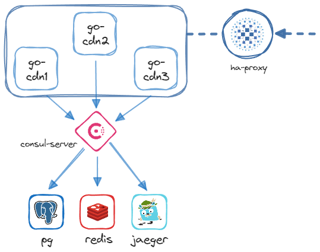

# Go-CDN
Microservice that serves image BLOBs via a REST API, using the following services:
- [Postgres](https://github.com/postgres/postgres) as primary Database
- [Redis](https://github.com/redis/redis) as cache (LFU)
- [Consul](https://github.com/hashicorp/consul) for Service Discovery
- [HAProxy](https://github.com/haproxy/haproxy/) as Load Balancer
- [Jaeger](https://github.com/jaegertracing/jaeger) as Tracing Platform

## Architecture


# Configuration Sample (config.yaml)
```yaml
consul:
  enable: 
  service_name:    # Service under which the microservices will be registered. Each one will have an unique id.
  service_address: # Either auto or manually set. auto finds the first non-loopback address.
  address: 
  datacenter: 
  port: 

redis:
  enable:       # Optional
  host:         # If Consul is enabled then this is the service name, otherwise ip:port
  password: 
  db: 

postgres:
  host:         # If Consul is enabled then this is the service name, otherwise ip:port
  database: 
  username:
  password: 
  ssl:              # Optional

http:
  port:             # Optional
  allow_insert: 
  allow_delete:
  rate_limit_enable:
  rate_limit:       # RPS

telemetry:
  jaeger_address:    # If Consul is enabled then this is the service name, otherwise ip:port
  logs_path: 
  logs_max_size:     # Optional
  logs_max_backups:  # Optional
  logs_max_age:      # Optional
```

# Docker Deployment
## Build the image
```bash
docker build -t local/go-cdn .
```
## Run
```bash
docker run -v "./config/config-docker.yaml:/cdn/config.yaml:ro" --net "cdn-default" -d local/go-cdn
```

## Docker Compose
Check the provided `docker-compose.yml` for a deployment example. The provided stack contains an example Consul container for demo purposes.
```bash
docker compose build 
docker compose up -d
docker compose logs -f
```

# Testing
Due the nature of Go, tests are ran inside their respective packages. This creates confusion with the relative paths regarding configs and migrations.
To get around this limitation it's possible to compile each test individually, and then run it from the root of the folder:
```bash
go test -c ./...
./{PACKAGE}.test 
```
Otherwise use:

```bash
make test
```
